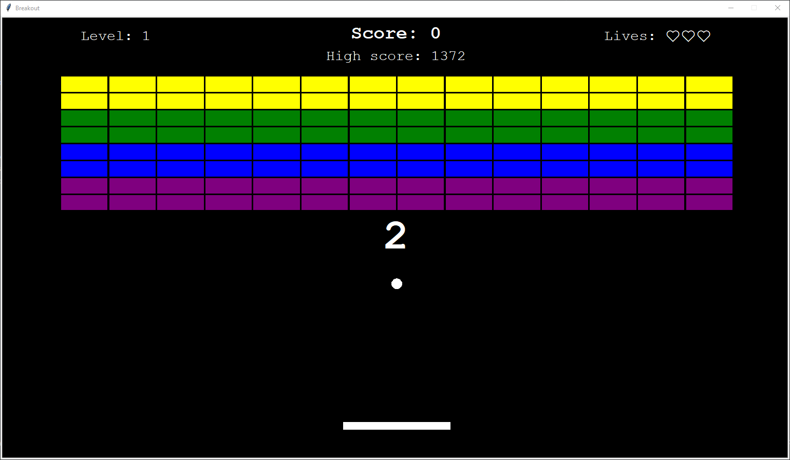

# Breakout

A classic Breakout-style desktop game built with Python and Turtle, featuring paddle-based gameplay, brick collision detection, multiple levels, lives, scoring, and persistent high scores.

---

## Demo



## Features

* Classic Breakout-style gameplay
* Paddle and wall collision detection
* Brick collision detection with directional bouncing
* Multiple levels with increasing difficulty
* Paddle size decreases with each level
* Ball speed increases during gameplay
* Lives system
* Score and persistent high score
* Countdown before each round
* Pause and resume functionality
* Retry/Exit after Game Over
* Keyboard controls
* Responsive game window based on the primary monitor resolution

## Technologies

* Python 3
* Turtle
* ScreenInfo

## Controls

| Key | Action |
|---|---|
| A / Left Arrow | Move paddle left |
| D / Right Arrow | Move paddle right |
| Space / Escape | Pause / Resume |
| Y | Play again after Game Over |
| N | Exit after Game Over |

## Run Locally

Clone the repository:

```bash
git clone https://github.com/NugyTomas/breakout-game.git
```
Install dependencies:

```bash
pip install -r requirements.txt
```

Run the game:

```bash
python main.py
```

## Screenshots

### Countdown


### Pause


### Game over


